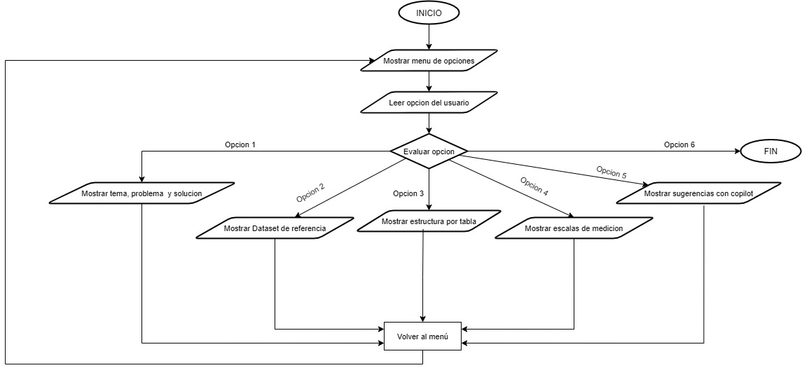

# Documentación

## 1. Tema, problema y solución

###  Tema
Aurelion es un supermercado mayorista dedicado a la distribución de productos de consumo diario, como bebidas, alimentos envasados, etc. El objetivo es modernizar la gestión comercial y administrativa del mayorista mediante la digitalización de los procesos de ventas, control de stock y análisis de rentabilidad, reemplazando la administración manual por un sistema automatizado que integre toda la información clave del negocio y facilite la toma de decisiones.

### Problema
El supermercado no cuenta con una forma clara de analizar qué productos se venden más, cómo pagan los clientes y qué artículos tienen poca rotación. La información está dispersa en distintos archivos y no se puede obtener fácilmente un análisis de ventas, métodos de pago o desempeño de productos.

### Solución Propuesta
Implementar un sistema que unifique los datos de ventas, clientes y productos para generar automáticamente:
- un dataset combinado con toda la información (ventas, clientes, productos) para análisis centralizado.
- ranking de productos y categorías según unidades vendidas e importe total (acumulado).
- análisis de medios de pago (ventas, importe total, ticket promedio, clientes únicos) y segmentación de clientes por frecuencia de compra.

El sistema permitirá identificar qué productos rinden, cómo prefieren pagar los clientes y cuáles casi no se venden, mejorando decisiones de surtido, promociones y control de stock.

## 2. Dataset de referencia:
(fuente, definición, estructura, tipos y escala de medición)

**Fuente:**

- **productos.xlsx:** Lista de productos con su categoria y precio unitario.
- **clientes.xlsx:** Registro de clientes con su informacion de contacto.
- **ventas.xlsx:** Detalle de cada venta realizada, incluyendo fecha, cliente y productos vendidos.
- **detalle_ventas.xlsx:** Detalle de los productos incluidos en cada venta, con cantidad y precio unitario.


**Definición:**

**productos.xlsx** ~ 100 filas
| Campo            | Tipo | Escala   | Descripción                      |
|------------------|------|----------|----------------------------------|
| id_producto      | int  | Nominal  | Identificador único del producto  |
| nombre_producto  | str  | Nominal  | Nombre del producto               |
| categoria        | str  | Nominal  | Categoría a la que pertenece      |
| precio_unitario  | int  | Razón    | Precio por unidad del producto    |

**clientes.xlsx** ~ 100 filas
| Campo           | Tipo | Escala   | Descripción                         |
|-----------------|------|----------|-------------------------------------|
| id_cliente      | int  | Nominal  | Identificador único del cliente     |
| nombre_cliente  | str  | Nominal  | Nombre del cliente                  |
| email           | str  | Nominal  | Correo electrónico del cliente      |
| ciudad          | str  | Nominal  | Ciudad del cliente                  |
| fecha_alta      | str  | Nominal  | Fecha de alta del cliente           |

**ventas.xlsx** ~ 120 filas
| Campo        | Tipo | Escala   | Descripción                         |
|--------------|------|----------|-------------------------------------|
| id_venta     | int  | Nominal  | Identificador único de la venta     |
| fecha        | str  | Nominal  | Fecha en que se realizó la venta    |
| id_cliente   | int  | Nominal  | Identificador del cliente           |
| nombre_cliente| str  | Nominal  | Nombre del cliente                  |
| email        | str  | Nominal  | Correo electrónico del cliente      |
|medio_pago   | str  | Nominal  | Medio de pago utilizado             |

**detalle_ventas.xlsx** ~ 120 filas
| Campo        | Tipo | Escala   | Descripción                         |
|--------------|------|----------|-------------------------------------|
| id_venta     | int  | Nominal  | Identificador único del detalle     |
| id_producto  | int  | Nominal  | Identificador del producto          |
|nombre_producto| str  | Nominal  | Nombre del producto                 |
| cantidad     | int  | Razón    | Cantidad vendida del producto       |
| precio_unitario| int  | Razón    | Precio por unidad del producto      |
|importe      | int  | Razón    | Importe total (cantidad * precio)   |

**dataset_completo.csv** (derivado / interim)
| Campo            | Tipo | Escala | Descripción |
|------------------|------|--------|-------------|
| id_venta         | int  | Nominal | ID de la venta (join principal) |
| id_producto      | int  | Nominal | ID del producto |
| cantidad         | int  | Razón   | Unidades del producto en esa venta |
| importe          | int  | Razón   | Importe de la línea (cantidad * precio_unitario) |
| fecha            | str  | Nominal | Fecha de la venta (AAAA-MM-DD) |
| id_cliente       | int  | Nominal | ID del cliente |
| medio_pago       | str  | Nominal | Medio de pago utilizado |
| ciudad           | str  | Nominal | Ciudad del cliente |
| fecha_alta       | str  | Nominal | Fecha de alta del cliente |
| categoria        | str  | Nominal | Categoría del producto |
| precio_unitario  | int  | Razón   | Precio unitario del producto (normalizado) |
| nombre_producto  | str  | Nominal | Nombre del producto (normalizado) |
| nombre_cliente   | str  | Nominal | Nombre del cliente (normalizado) |
| email            | str  | Nominal | Email del cliente |

## 3. Información, pasos, pseudocódigo y diagrama del programa (Sprint 1)

### 3.1 Contenidos accesibles desde el menú

1. Tema, problema y solución.
2. Dataset de referencia. Resumen de fuente y definición.
3. Estructura por tabla. Columnas, tipo y escala de medición.
4. Escalas de medición. Descripción y ejemplos.
5. Sugerencias y mejoras con Copilot.
6. Análisis completo (rankings + medios de pago).
7. Ver gráficos específicos (submenú).
8. Regenerar datos limpios (limpieza).
9. Salir.

### 3.2 Pasos
1. Crear un diccionario con los textos de documentación (tema, dataset, estructura, escalas, sugerencias).
2. Mostrar el menú principal (opciones 1 a 9).
3. Validar la opción ingresada (solo números dentro del rango).
4. Si opción 1–5: mostrar el texto correspondiente.
5. Si opción 6: ejecutar análisis completo (carga de datos, rankings y análisis de medios de pago con visualizaciones).
6. Si opción 7: mostrar submenú de gráficos específicos y ejecutar solo el gráfico elegido.
7. Si opción 8: ejecutar limpieza (regenerar datasets interim).
8. Si opción 9: finalizar el programa.
9. Tras cada ejecución (excepto salir), pausar hasta que se presione Enter y volver al menú.


### 3.3 Pseudocódigo

Inicio
```bash
Cargar diccionario_textos (claves 1..5) 
Mientras True:
    Mostrar menú principal:
        1. Tema, problema y solución
        2. Dataset de referencia
        3. Estructura por tabla (tipo y escala)
        4. Escalas de medición
        5. Sugerencias y mejoras con Copilot
        6. Análisis completo (rankings + medios de pago)
        7. Ver gráficos específicos
        8. Regenerar datos limpios (limpieza)
        9. Salir
    Leer opción (input)
    Validar: si no es entero o fuera de 1..9 -> mostrar error y continuar
    Si opción en 1..5:
        mostrar diccionario_textos[opción]
    Si opción == 6:
        mostrar análisis completo (rankings + medios de pago)
    Si opción == 7:
        Mostrar submenú gráficos:
            1. Top productos por unidades
            2. Top productos por importe
            3. Top categorías por unidades
            4. Top categorías por importe
            5. Resumen medios de pago (barras)
            6. Heatmaps medios de pago vs segmento
            7. Volver
        Leer subopción
        Si subopción == 7: continuar (volver al menú principal)
        Caso contrario: mostrar el gráfico solicitado
    Si opción == 8:
        regenerar datos limpios (actualizar archivos interim) y mostrar confirmación
    Si opción == 9:
        mostrar mensaje de salida
        break
    Pausa (esperar Enter) antes de nueva iteración
Fin
```

### 3.4 Diagrama de flujo:



*Diagrama que muestra el flujo del programa desde el inicio hasta la salida, incluyendo la evaluación de opciones y el retorno al menú principal.*


### 4. Sugerencias y mejoras aplicadas con Copilot

- Implementar validaciones de entrada para evitar errores por datos incorrectos.
- Permitir la carga y actualización de datos desde archivos CSV además de Excel.
- Agregar exportación de reportes en diferentes formatos (PDF, Excel).
- Incorporar autenticación básica para proteger el acceso al sistema.
- Mejorar la interfaz de usuario en consola con colores y formato.
- Automatizar la generación de gráficos simples desde Python.
- Documentar el código fuente con comentarios y ejemplos de uso.
- Modularizar el programa en funciones y clases para facilitar el mantenimiento.
- Añadir logs de actividad para auditoría y seguimiento de errores.
- Permitir la integración con otros sistemas mediante API REST en el futuro.


